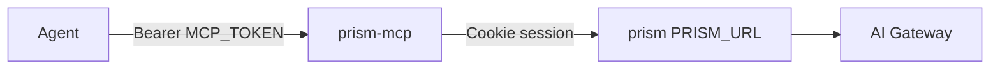

# CLAUDE.md

Guidance for Claude Code (and the crew) working in this repo.

## What this is

**`@skyphusion/prism-mcp`:** MCP door for the Prism playground API. Stateless Streamable-HTTP
Worker that proxies curated tools to a prism host (`PRISM_URL`). Implementation lives here; deploy
config is wrangler + secrets only.

**Status: v1.0.0** (root `package.json` / tags / `CHANGELOG.md`). Estate peers **prism**,
**prism-control-plane**, **prism-ios**, **prism-android** are also at **1.0.0** (2026-08-07).

- Tool catalog: `export const TOOLS` in `src/mcp-tools.ts` (re-count from code if the number drifts).
- License: **MIT** (client door). Prism remains AGPL.
- Version: root `package.json` / release tags / `CHANGELOG.md`.

## Relation to the stack

| Repo | Role |
|------|------|
| **This package** | MCP server + tool catalog (npm + Worker entry) **1.0.0** |
| `prism` | Multimodal playground API (`/api/*`) **1.0.0** |
| `prism-control-plane` | Metered proxy; used when the prism user has a `pcp_` key in prefs **1.0.0** |
| `prism-ios` / `prism-android` | Native clients **1.0.0** |

MCP talks to **prism**, not directly to the control plane. Control-plane spend is whatever the
seeded prism session has configured under Account prefs.

## Commands

```bash
npm run typecheck
npm test
npm run test:coverage
npm run build
```

## Deploy model

1. **npm publish** on tag `prism-mcp-v*` (`.github/workflows/publish-npm.yml`). Tag must match
   `package.json` and be an ancestor of `main`.
2. **Worker deploy** is operator-side: pin the package, `main` → `dist/mcp.js`, secrets
   `MCP_TOKEN` + `PRISM_SESSION`, var `PRISM_URL`. See `wrangler.mcp.toml.example` and `docs/mcp.md`.

## Architecture (load-bearing)

- **Two credentials.** Agent presents `MCP_TOKEN`; Worker forwards prism session cookie. Prism
  cookie never leaves the Worker.
- **No prism bindings.** Pure HTTP to `PRISM_URL`.
- **Stateless.** Video/music/zip jobs: agent polls `poll_job` / `poll_import`.
- **One tool, one route** (+ `prism_request` escape hatch). Live WebSocket STT
  (`/api/stt/stream`) is out of scope for MCP tools.



Public docs with full diagrams: `README.md`, `docs/mcp.md`, `docs/PARITY.md`.

## Hard rules

- Typecheck is the CI gate. Run before push.
- Never a plaintext secret in a tracked file.
- No em-dashes / en-dashes; use `--` or commas.
- Verify live `/health` + tools/list, not only green CI.
- Aviation-grade `main` (PR-required, CI green) on the public repo.

## Crew + identity

Conrad laptop commits: `Conrad Rockenhaus <conrad@skyphusion.org>`. Crew on dischord: member
identity via `sudo -u <member>`. Conventional Commits; SemVer on the package.

## Hosted door

First-party Worker: `https://prism-mcp.skyphusion.org` (tag-gated deploy on `prism-mcp-v*`).
Self-host still supported via wrangler template.
