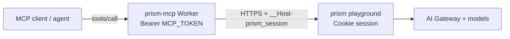

# @skyphusion/prism-mcp

**License:** MIT  
**Version:** 1.0.0  
**API:** [prism](https://github.com/skyphusion-labs/prism) (AGPL playground Worker)  
**Control plane (metered commercial door):** [prism-control-plane](https://github.com/skyphusion-labs/prism-control-plane)

Agent **MCP** for [Prism](https://play.skyphusion.org): HTTP parity with the prism `/api/*`
surface so coding agents can chat, generate images/video/music/TTS, manage RAG documents and
projects, compact long threads, and poll long jobs -- without a browser.

Stateless [Model Context Protocol](https://modelcontextprotocol.io/) Worker that proxies curated
tools to a prism instance over HTTPS.

**Parity:** [docs/PARITY.md](docs/PARITY.md) -- full HTTP agent parity in 1.0.0; live Flux mic
WebSocket is the only major human SPA gap.

## Architecture



## Install

```bash
npm install @skyphusion/prism-mcp
```

## Deploy (Cloudflare Workers)

```toml
main = "node_modules/@skyphusion/prism-mcp/dist/mcp.js"
```

See [docs/mcp.md](docs/mcp.md) for secrets, session seeding, agent wiring, and the tool catalog.

| Binding | Kind | Role |
|---------|------|------|
| `PRISM_URL` | var | Prism base URL (e.g. `https://play.skyphusion.org`) |
| `PRISM_SESSION` | secret | Raw `__Host-prism_session` cookie value |
| `MCP_TOKEN` | secret | Agent gate (`Authorization: Bearer …`) |

Optional: `PRISM_ACCESS_EMAIL`, `PRISM_ACCESS_CLIENT_ID`, `PRISM_ACCESS_CLIENT_SECRET` for
Access-mode / Access-fronted self-hosts.

## Tools (1.0.0)

| Area | Tools |
|------|--------|
| Health | `health`, `health_deep` |
| Catalog / prefs | `list_models`, `get_prefs`, `update_prefs` |
| Generation | `chat`, `chat_stream`, `tts` |
| History | `list_history`, `get_history`, `delete_history` |
| Conversations | `list/get/delete_conversation`, `move_conversation_to_project`, **`compact_conversation`**, **`clear_conversation_compact`** |
| RAG | `list/get/upload/delete_document`, `poll_import` |
| Projects | CRUD, attach/detach docs, `import_discord` |
| Jobs / media | `poll_job`, `get_artifact` |
| Escape | `prism_request` (any path) |

**Not a tool:** WebSocket `/api/stt/stream` (live Flux). Approximate with STT chat + TTS.

## Package layout

| Import | Role |
|--------|------|
| `@skyphusion/prism-mcp` | Default Worker export (`fetch` handler) |
| `@skyphusion/prism-mcp/mcp-env` | `McpEnv` bindings |
| `@skyphusion/prism-mcp/mcp-tools` | Tool catalog + `runTool` |

## License

MIT (this package). Prism itself remains AGPL-3.0-only.

## Hosted door

First-party Worker: `https://prism-mcp.skyphusion.org` (tag-gated deploy on `prism-mcp-v*`).
Self-host still supported via wrangler template.
