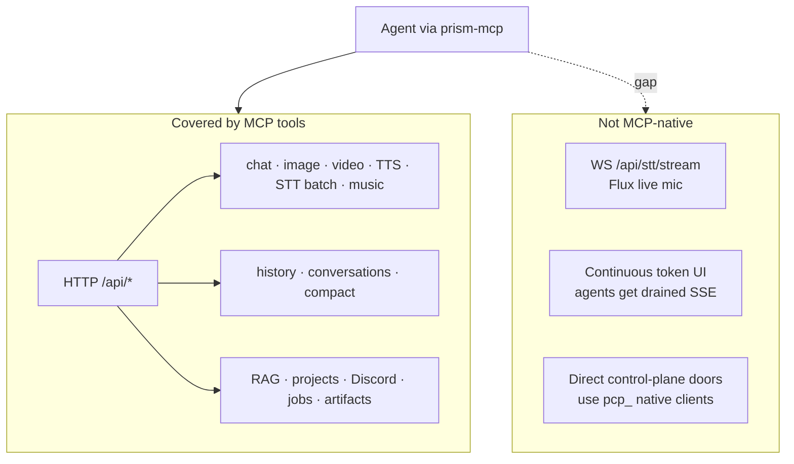
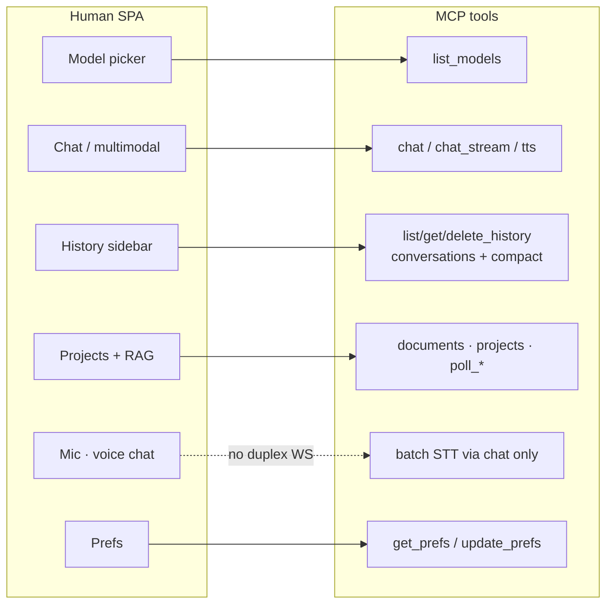
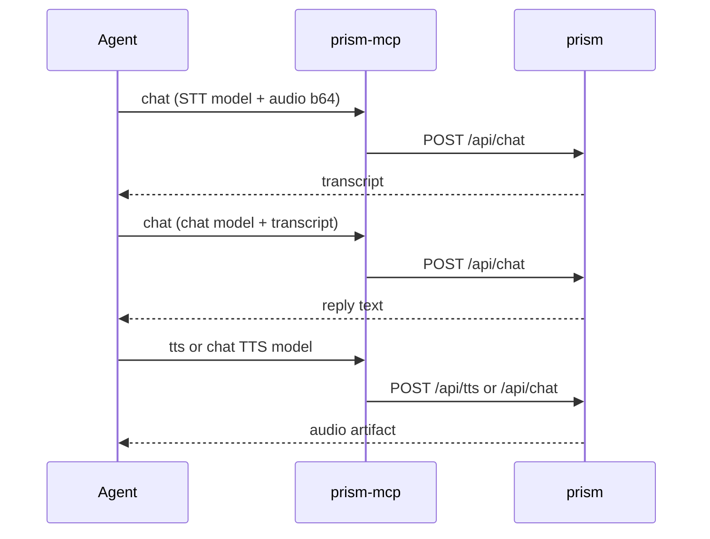
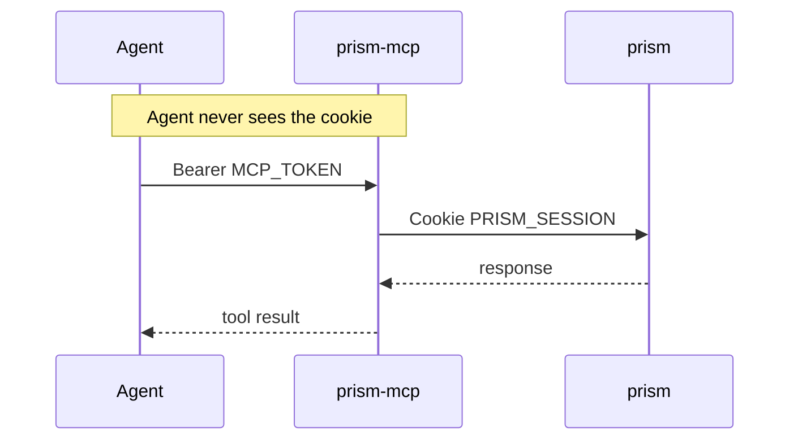
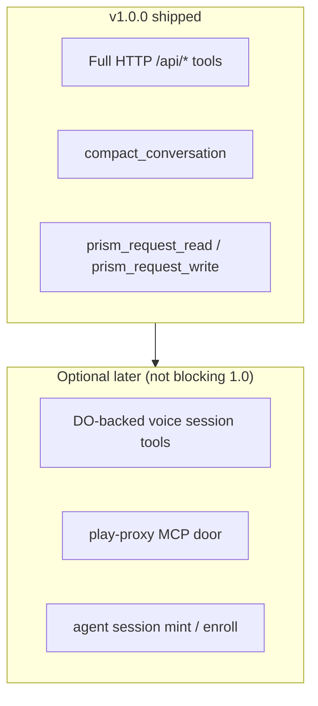

# Prism MCP vs human SPA parity (v1.0.0)

Target: can an agent drive **prism** (playground Worker at `play.skyphusion.org`)
as completely as a human in the browser?

## Verdict

| Layer | Status |
| --- | --- |
| **HTTP `/api/*` (agent-usable)** | **Yes** -- curated tools + `prism_request_read` / `prism_request_write` |
| **Real-time live mic / voice chat** | **No** -- WebSocket Flux not MCP-transportable |
| **Native control plane (iOS-style)** | **Out of scope** -- this MCP talks to **prism**, not play-proxy |

**v1.0.0 claim:** full **HTTP agent parity** for the playground API. Not bit-identical UX to a human (no live duplex voice, no continuous SSE token stream).

## Capability matrix

| Human SPA capability | MCP tool | Notes |
| --- | --- | --- |
| Boot / model list | `list_models` | Public probe |
| Account prefs (gateway / pcp_) | `get_prefs`, `update_prefs` | |
| Chat (all model types) | `chat` | chat, image, tts, video, stt, music |
| Streaming chat | `chat_stream` | SSE drained to one text block |
| TTS without history row | `tts` | Voice-chat speak path |
| History CRUD | `list/get/delete_history` | |
| Conversations CRUD | `list/get/delete_conversation` | |
| Move conversation → project | `move_conversation_to_project` | |
| Compact / expand context | `compact_conversation`, `clear_conversation_compact` | v1.0.0 |
| RAG documents | list/get/upload/delete + `poll_import` | |
| Projects CRUD + doc attach | full project tools | |
| Discord import | `import_discord` | |
| Long video/music jobs | `chat` + `poll_job` | |
| Download artifacts | `get_artifact` | Images may inline |
| Signup / login / logout | `prism_request_write` | Session usually operator-seeded |
| Delete account | `prism_request_write` | Deliberate; not a casual tool |
| Deep health | `health_deep` | |
| **Live Flux mic / voice chat loop** | **none** | WS `/api/stt/stream` |
| Continuous token streaming UI | n/a | Agents get drained SSE |

### Map: SPA surface → tools

### Voice workaround (agent)

1. Capture audio offline → base64 attachment  
2. `chat` with Whisper / Nova model → transcript  
3. `chat` with any chat model → reply  
4. `tts` or `chat` with Aura/Melo → audio artifact  

Not hands-free duplex; good enough for batch voice pipelines.

## Auth model (not human browser)

Human logs in via SPA; operator pastes `__Host-prism_session` into Worker secret.
Agent never sees the cookie. Compromised agent = rotate `MCP_TOKEN` only.

## Residual gaps (if you need true human twin)

| Gap | Why | Fix path |
| --- | --- | --- |
| Live STT WebSocket | MCP is request/response; Flux is duplex WS | Optional companion Worker that owns a DO session and exposes `start_voice` / `send_audio_chunk` / `end_voice` tools; or agent-side WS outside MCP |
| Control-plane doors | MCP is playground-scoped | Separate MCP for `play-proxy` (Bearer `pcp_`) if agents must drive commercial iOS surface |
| Session minting | No MFA-free agent login in product | Keep operator seed; or add short-lived enroll tokens for agents |

## Tool count (v1.0.0)

32 curated tools + `prism_request_read` / `prism_request_write` (see `src/mcp-tools.ts`).
