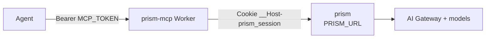
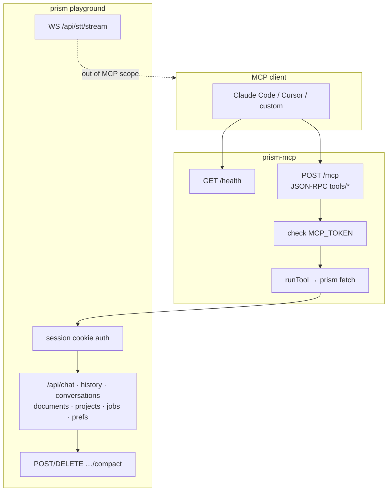
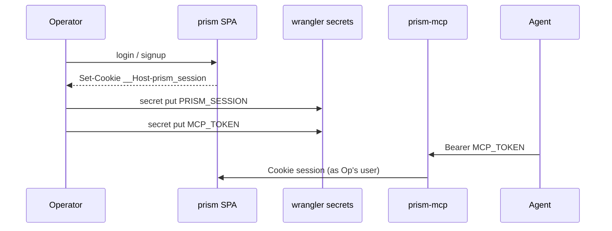
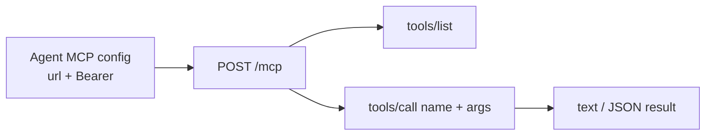
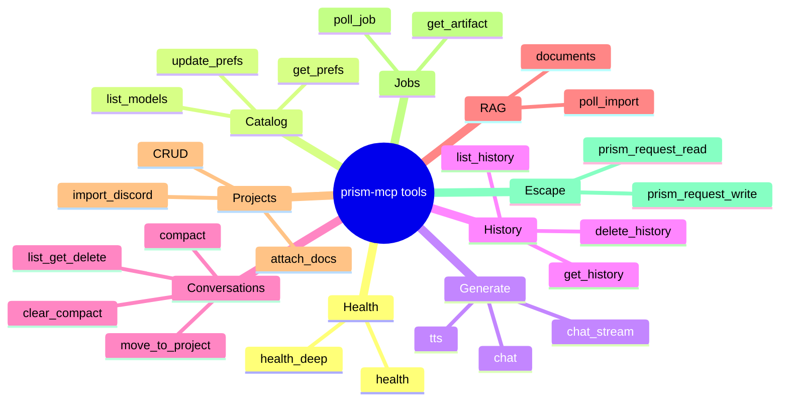
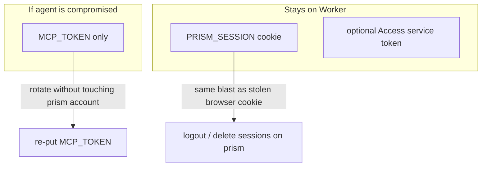

# Prism MCP

Drive [Prism](https://play.skyphusion.org) from an AI agent (Claude Code, Cursor, or any MCP client)
instead of the browser. Implementation: **`@skyphusion/prism-mcp`**.

**License:** MIT for this door. Prism remains AGPL-3.0-only.  
**Version:** 1.0.0 · **Hosted:** `https://prism-mcp.skyphusion.org`

## Why a separate Worker

- **Two credentials.** Agent presents `MCP_TOKEN`; prism session cookie (`PRISM_SESSION`) never leaves the Worker.
- **No prism bindings.** Points at any prism URL over HTTPS.
- **Stateless.** Long jobs: agent calls `poll_job` / `poll_import`.



## Architecture (detail)



## Before you start

1. A reachable prism over HTTPS (hosted play or self-host).
2. A logged-in **session** for the account the agent should act as:
   - Sign up / log in on the SPA, or `POST /api/auth/login` with username/password.
   - Copy the `__Host-prism_session` cookie value (devtools → Application → Cookies, or
     `Set-Cookie` from login).
   - That raw value is `PRISM_SESSION` (never commit it).
3. Configure that account's gateway / `pcp_` key under Account prefs if you want inference to work
   (same as a human user on play).
4. A custom domain for the MCP Worker (example: `prism-mcp.example.com`).

### Session seed flow



## Deploy

| Value | Kind | What |
|-------|------|------|
| `PRISM_URL` | var | e.g. `https://play.skyphusion.org` |
| `PRISM_SESSION` | secret | Cookie value for `__Host-prism_session` |
| `MCP_TOKEN` | secret | Agent bearer |

```sh
MCP_HOST="prism-mcp.example.com" MCP_PRISM_URL="https://play.skyphusion.org" \
  envsubst '$MCP_HOST $MCP_PRISM_URL' < wrangler.mcp.toml.example > wrangler.mcp.toml

npx wrangler deploy -c wrangler.mcp.toml
npx wrangler secret put PRISM_SESSION -c wrangler.mcp.toml
umask 077 && openssl rand -hex 32 > mcp-token.txt
npx wrangler secret put MCP_TOKEN -c wrangler.mcp.toml < mcp-token.txt
```

Optional Access-mode vars/secrets: `PRISM_ACCESS_EMAIL`, `PRISM_ACCESS_CLIENT_ID`,
`PRISM_ACCESS_CLIENT_SECRET` (see `src/mcp-env.ts`).

## Check that it works

```sh
curl -s https://prism-mcp.example.com/health
# {"ok":true,"service":"prism-mcp"}

curl -s https://prism-mcp.example.com/mcp \
  -H "Authorization: Bearer $(cat mcp-token.txt)" \
  -H "content-type: application/json" \
  -d '{"jsonrpc":"2.0","id":1,"method":"tools/list"}'
```

## Connect an agent

MCP Streamable HTTP: `POST https://prism-mcp.example.com/mcp` (or hosted
`https://prism-mcp.skyphusion.org/mcp`) with `Authorization: Bearer <MCP_TOKEN>`.



## Tool reference

Curated tools map 1:1 to prism routes (see prism `CLAUDE.md` Routes reference). Escape hatch:
`prism_request_read` (GET/HEAD) or `prism_request_write` (POST/PATCH/PUT/DELETE)
with `method` + `path`. `prism_request` is a write-only alias.

Every tool carries MCP 2025-06-18 `annotations` (`readOnlyHint` / `destructiveHint` /
`idempotentHint`) so a client can auto-approve reads and gate the tools that can irreversibly
change or discard state: `delete_history`, `delete_conversation`, `delete_document`,
`delete_project`, `update_prefs` (its `clear_*` fields discard a stored credential), and
`prism_request_write` / `prism_request` (write escape hatch). Reads go through `prism_request_read`.

| Tool | Prism route |
|------|-------------|
| `health` / `health_deep` | `GET /health`, `GET /health/deep` |
| `list_models` | `GET /api/models` |
| `get_prefs` / `update_prefs` | `GET` / `PATCH /api/prefs` |
| `chat` | `POST /api/chat` (all model types) |
| `chat_stream` | `POST /api/chat/stream` (SSE drained to text) |
| `tts` | `POST /api/tts` |
| `list_history` / `get_history` / `delete_history` | `/api/history` |
| `list_conversations` / `get_conversation` / `delete_conversation` | `/api/conversations` |
| `move_conversation_to_project` | `PATCH /api/conversations/:id/project` |
| `compact_conversation` | `POST /api/conversations/:id/compact` |
| `clear_conversation_compact` | `DELETE /api/conversations/:id/compact` |
| `list_documents` / `get_document` / `upload_document` / `delete_document` | `/api/documents` |
| `poll_import` | `GET /api/import/:id` |
| `list_projects` / `get_project` / `create_project` / `update_project` / `delete_project` | `/api/projects` |
| `add_project_document` / `remove_project_document` | project doc attach |
| `import_discord` | Discord ingest on a project |
| `poll_job` | `GET /api/job/:id` |
| `get_artifact` | `GET /api/artifact/*` |
| `prism_request_read` | GET/HEAD any path |
| `prism_request_write` (`prism_request` alias) | POST/PATCH/PUT/DELETE any path |

Full parity matrix: [PARITY.md](./PARITY.md).

### Tool groups (mental model)



### Out of scope (v1.0)

- **WebSocket STT / live voice chat** (`/api/stt/stream`): duplex Flux mic; not MCP request/response. Approximate with batch STT `chat` + `tts`.
- **Account delete**: use the SPA or `prism_request_write` deliberately.
- **Control plane (play-proxy)**: this door is playground prism only; prefs may store a `pcp_` for hybrid use on the prism Worker.

## Security boundary



- Agent compromise exposes `MCP_TOKEN` only; rotate without touching the prism account.
- Prism session compromise is the same as a stolen browser cookie; revoke via logout / delete sessions on prism.
- **The "agent never sees the cookie" guarantee is scoped to normal use, not enforced end to end.**
  `prism_request` is a generic escape hatch: it attaches the session cookie / Access headers to
  any path and relays whatever body comes back, unfiltered. On `play.skyphusion.org` no route
  reflects session material into a response body, so the guarantee holds. A self-host or fork that
  adds a route reflecting the cookie (or any secret) into its response would leak that value to the
  agent through this door. This server does not filter `prism_request` output; treat that as a
  property of your own prism deployment's routes, not of this server.
- **Relayed prism output is untrusted content, not delimited or labelled as such.** Every tool
  result is `<METHOD> <path> -> <status>` plus the raw body. `chat` / `chat_stream` with
  `use_web_search` or `use_docs` set can carry attacker-influenced web/RAG text back into the
  agent's context the same way; this is common MCP-proxy behavior, not unique to prism-mcp, but it
  is a property an embedder should know rather than assume.
- Never put secrets in the git repo or agent config files that get committed.

## Hosted door

First-party Worker: `https://prism-mcp.skyphusion.org` (tag-gated deploy on `prism-mcp-v*`).
Self-host still supported via wrangler template.
